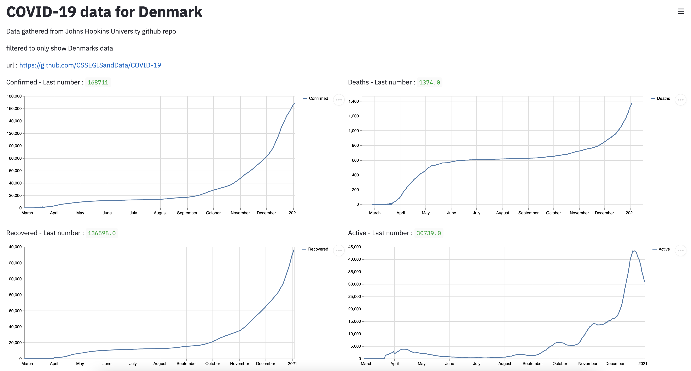

# Covid-19 dashboard, that gatheres data from Johns Hopkins university's Github page.

All data is filtered to only show main Denmark. 
This is mostly ment, as a project, for me to learn, how to gather data, from websites etc. and present them, in an easy way. 

For live demo, see :

https://covid19.robert-jensen.dk

